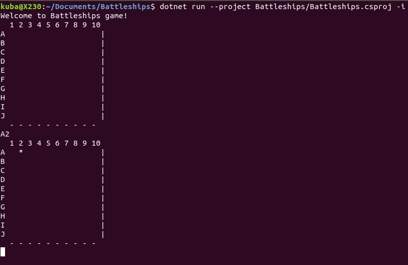

# Battleships

Console single side game of Battleships

## Running

### Prerequisites
 - .NET Core 2.2
 - optional Visual Studio Code or Visual Studio for development and debugging

### Running console app
`dotnet run --project Battleships/Battleships.csproj`

### Running tests
`dotnet test`

### TODOs
- notification hit/miss
- cheat mode (display grid cells with ships) for easier debugging
- CI with testing
